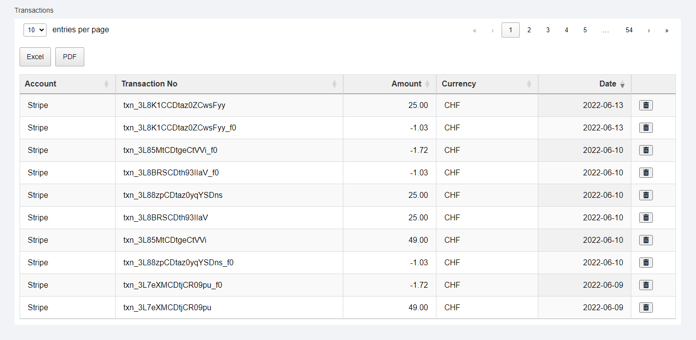

# Transaction Management System

A web-based application for managing financial transactions, multiple bank accounts, and currency exchange rates.




## Features

### File Upload
- Support for Excel files (.xlsx, .xls)
- Drag & drop interface
- Automatic data processing
- Transaction and account creation from uploaded data

### Currency Exchange Rates
- Real-time exchange rate fetching
- Caching system to avoid API limits
- Automatic conversion to CHF
- Visual rate display

### Bank Accounts Management
- View all bank accounts
- Edit account details inline
- Starting and end balance tracking
- Automatic balance calculation in original currency and CHF

### Transaction Management
- Server-side processing for large datasets
- Inline editing capabilities
- Delete functionality with confirmation
- Sorting and pagination
- Export to Excel and PDF

### Cash Forecast
- Visual representation of account balances over time
- Multiple account tracking
- Total balance line
- Interactive chart with export options

## Technical Stack

### Frontend
- jQuery 3.5.1
- DataTables for table management
- Highcharts for data visualization
- Font Awesome 5.15.4 for icons

### Backend
- PHP 5+ (5.7 in current version)
- MySQL/MariaDB
- PHPSpreadsheet for Excel file processing
- PDO for database operations

## Database Structure

The system uses three main tables:

```sql
-- Database dump from transactions_app-dump.sql file
CREATE TABLE `accounts` (
  `id` varchar(255) NOT NULL,
  `name` varchar(255) NOT NULL,
  `currency` varchar(3) NOT NULL,
  `initial_balance` decimal(15,2) DEFAULT 0.00,
  PRIMARY KEY (`id`)
);

CREATE TABLE `transactions` (
  `id` int(11) NOT NULL AUTO_INCREMENT,
  `account_id` varchar(255) NOT NULL,
  `transaction_no` varchar(255) NOT NULL,
  `amount` decimal(15,2) NOT NULL,
  `currency` varchar(3) NOT NULL,
  `date` date NOT NULL,
  PRIMARY KEY (`id`),
  KEY `account_id` (`account_id`),
  CONSTRAINT `transactions_ibfk_1` FOREIGN KEY (`account_id`) REFERENCES `accounts` (`id`)
);

CREATE TABLE `exchange_rates` (
  `id` int(11) NOT NULL AUTO_INCREMENT,
  `currency_from` varchar(3) NOT NULL,
  `currency_to` varchar(3) NOT NULL,
  `rate` decimal(15,6) NOT NULL,
  `last_updated` timestamp NOT NULL DEFAULT current_timestamp(),
  PRIMARY KEY (`id`),
  UNIQUE KEY `currency_pair` (`currency_from`,`currency_to`)
);
```

## Installation

1. Clone the repository:
```bash
git clone https://github.com/Shaykhnazar/transaction-management.git
```

2. Set up the database:
```bash
mysql -u root -p transactions_app < transactions_app-dump.sql
```

3. Configure the database connection in `config.php`:
```php
define('DB_HOST', 'localhost');
define('DB_NAME', 'your_database');
define('DB_USER', 'your_username');
define('DB_PASS', 'your_password');
```

4. Install dependencies:
```bash
composer install
```

5. Set up the exchange rate API:
- Get an API key from [exchangerate-api.com](https://www.exchangerate-api.com/)
- Add it to your configuration file

## Usage

### File Upload
1. Click "Browse files" or drag & drop an Excel file
2. File should contain columns: Account, Transaction No, Amount, Currency, Date
3. System will process the file and create/update accounts and transactions


### Managing Accounts
- Click on editable fields to modify account details
- Changes are saved automatically
- End balance is calculated based on initial balance and transactions


### Managing Transactions
- Use pagination to navigate through transactions
- Click on editable fields to modify transaction details
- Click the delete icon to remove transactions (confirmation required)
- Use export buttons to download transaction data


### Viewing Cash Forecast
- Chart automatically updates when data changes
- Hover over lines to see specific values
- Use export options to download the chart


## Development

### Project Structure
```
project_root/
├── api/
│   └── index.php
├── src/
│   ├── Repository/
│   │   ├── TransactionRepository.php
│   │   └── AccountRepository.php
│   └── Service/
│       ├── ExchangeRateService.php
│       └── FileProcessor.php
├── public/
│   ├── css/
│   └── js/
├── config.php
├── index.html
├── vendor/
└── README.md
```

## Contributing

1. Fork the repository
2. Create your feature branch (`git checkout -b feature/amazing-feature`)
3. Commit your changes (`git commit -m 'Add some amazing feature'`)
4. Push to the branch (`git push origin feature/amazing-feature`)
5. Open a Pull Request

## License

This project is licensed under the MIT License - see the LICENSE file for details.

## Acknowledgments

- [DataTables](https://datatables.net/)
- [Highcharts](https://www.highcharts.com/)
- [exchangerate-api.com](https://www.exchangerate-api.com/)
- [PHPSpreadsheet](https://github.com/PHPOffice/PhpSpreadsheet)
